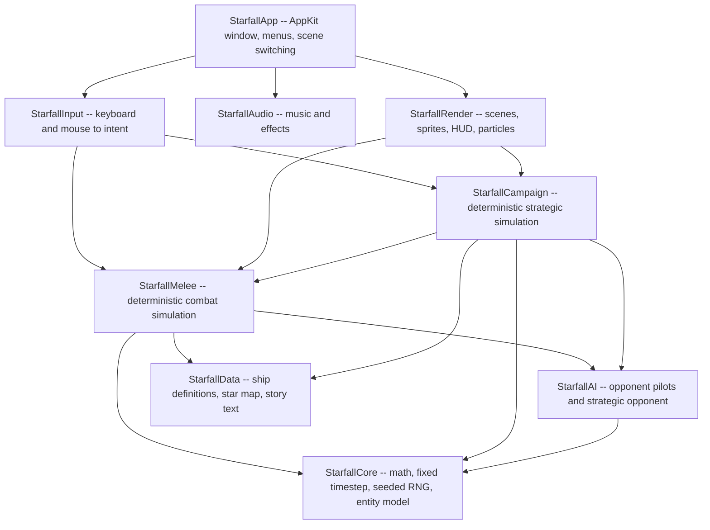

# Long-Running Job Test Prompt: "Starfall" (Star Control Recreation)

## Purpose (meta -- read this, do not send it to the model)

This document holds a single, self-contained, model-agnostic prompt used to
exercise **long-running agentic jobs** inside a new Erebine workspace. It is a
load test with a real deliverable: the job must produce a working native macOS
game, not a plan or a sketch.

Properties that make it a good long-job fixture:

- **Wide, deep, and verifiable.** Research, asset production, engine code,
  gameplay tuning, and tests. Success is machine-checkable (it builds, it runs
  at frame rate, the tests pass, the campaign can be won and lost).
- **No natural stopping point before Done.** The prompt defines an explicit
  Definition of Done and forbids stopping short of it, which is exactly the
  behavior a long-job harness needs to stress.
- **Forced adversarial review loops.** The model must attack its own output on
  a schedule, which drives token burn and multi-hour wall-clock without
  degenerating into busywork.
- **Persistence pressure.** Progress must be journaled continuously, so a
  resumed or restarted job can pick up cleanly. This tests session recovery.

Everything from the horizontal rule onward is the prompt. Send it verbatim.
It stays model-agnostic -- any model can run it -- but it is no longer
harness-agnostic: it assumes an Erebine workspace and calls that harness's
artifact, decision, milestone, and memory tools by name (section 13). To replay
it against a harness that lacks those tools, swap those calls for whatever
durable store that harness provides; nothing else in the prompt is
Erebine-specific.

**Four deliberate design decisions inside the prompt, called out here so a
reviewer does not mistake them for drift from the request:**

1. **Phase 0 forces research with citations before any spec is written.** The
   original Star Control (Accolade, 1990) ship rosters, energy costs, and crew
   counts are exactly the kind of detail a model will hallucinate fluently. If
   the model writes the spec from memory, every downstream phase inherits the
   error and the "faithful recreation" goal is silently lost. So the prompt
   bans memory-sourced specs. The same discipline extends to the setting:
   Phase 0 also researches the source lore so the campaign can be an original
   adventure transformed from it, not a thin retelling written from
   half-memory (sections 3 and 8).
2. **There is an IP and licensing guardrail.** The Star Control rights
   situation is genuinely contested, and the open-source descendant of the
   sequel carries a non-commercial content license. An unsupervised agent will
   otherwise reach for original sprites and audio. The prompt requires original
   or provably-licensed assets and requires the model to record what it
   verified.
3. **Visual assets must be model-generated vector art (SVG).** The prompt
   forbids sourced or raster sprites and requires the model to author its own
   SVG as the authoritative asset. This is deliberate: SVG is a text format the
   model can genuinely produce, it holds high fidelity at every zoom level the
   melee camera demands, and it is verifiable -- the vector source lives in the
   repo and everything the renderer shows derives from it by one reproducible
   command, so "art" becomes real, checkable work rather than a grey-rectangle
   stub. How that SVG reaches the screen is the model's call: rasterize it into
   textures for a texture-based renderer, or render the vectors directly at
   runtime. Section 5 leaves the renderer open and section 9 owns this rule.
4. **Sub-plans are durable Erebine artifacts, and progress is tracked in the
   workspace, not just in files.** The prompt requires the model to persist a
   per-phase sub-plan as its own artifact and to record decisions, milestones,
   and memories through the Erebine tools as it works. This is deliberate on two
   counts: it exercises the workspace's durable-memory surface -- the point of
   running this fixture inside Erebine at all -- and it is the real test of
   session recovery, because a job restarted with no working memory must be able
   to reload the artifacts, decisions, milestones, and memories and continue. It
   is also why this prompt is not harness-portable as written; see the note
   above the rule. Section 13 owns this requirement.

---

# PROMPT: Build "Starfall", a native macOS recreation of Star Control

You are an autonomous senior game engineer. You are going to build a complete,
playable, native macOS game in Swift, from an empty directory to a shippable
artifact, without stopping partway.

Read this entire brief before you take any action.

## 1. The mission

Build **Starfall**: a faithful recreation of the gameplay of the original
MS-DOS game *Star Control* (Accolade, 1990), set in a story loosely inspired by
the universe of *Star Control 1* and *Star Control 2* only. Nothing from *Star
Control 3* or from any later or unrelated title enters this project.

The game has two halves, and both must ship:

- **Melee.** Real-time, top-down, two-dimensional one-on-one starship combat.
  Two ships of different designs fight in an arena that contains a planet whose
  gravity pulls on both of them. Every ship has a distinct hull, crew
  complement, energy pool, primary weapon, and a special ability that makes it
  play unlike any other ship. This is the heart of the game and it must feel
  good before anything else is polished.
- **Campaign.** A turn-based strategic layer played on a star map. Two rival
  powers expand across star systems, gather resources, build and move fleets,
  and fight for control. Every fleet engagement drops into the Melee layer and
  its outcome is written back to the map. The campaign has real win and loss
  conditions.

A person must be able to launch the app, learn the controls without a manual,
play a full melee match, play a campaign from opening move to victory or
defeat, and want to play again.

## 2. Operating contract -- how you must work

These rules are not advisory. They govern the whole job.

1. **Do not stop until the Definition of Done in section 12 is fully
   satisfied.** Do not stop to ask whether you should continue. Do not stop to
   present options and wait. Do not stop at a "good first milestone." If you
   hit an ambiguity, resolve it yourself: choose the option that best serves
   the mission, write down the choice and the reasoning in the decision log,
   and keep moving. The only acceptable reason to halt early is a hard external
   blocker you cannot work around (for example, no compiler is available), and
   in that case you must report precisely what is blocked and what you tried.
2. **Build it right the first time.** You are not producing a prototype to be
   thrown away. No placeholder logic that "will be replaced later." No
   functions that return fake data. No `TODO` markers left in shipped code. No
   silently swallowed errors. If a system is worth having, it is worth
   finishing now.
3. **Work in loops, not in one pass.** Each phase runs
   `build -> run -> observe -> attack -> fix -> re-verify` and does not exit
   until its own exit gate passes. A phase that "mostly works" has not passed.
4. **Verify with evidence, never with assertion.** You may not claim anything
   builds, runs, passes, or is complete unless you have just executed the
   command and read its output. Paste or summarize the real output. "Should
   work" is a forbidden phrase. If you did not run it, it does not count.
5. **Adversarially review your own work on a schedule.** See section 11. This
   is a hard requirement at every phase gate, not a final polish step.
6. **Journal continuously.** See section 13. Assume you may be interrupted at
   any moment and resumed later with none of your working memory. The journal
   is what makes you resumable.
7. **Never fabricate.** If you do not know a fact about the original game, go
   find it and cite where you found it. If you cannot find it, say so, make a
   documented design decision, and mark it as an intentional deviation. A
   confident wrong number is far worse than an honest gap.

## 3. Phase 0 -- Research before you specify (mandatory, do this first)

You almost certainly carry fuzzy half-memories of this game. Those memories are
not good enough and they will feel reliable while being wrong. Ship rosters,
crew counts, energy costs, and special abilities are precisely the details that
models invent fluently. If you write the spec from memory, every later phase
inherits the error and the recreation quietly stops being faithful.

So: research first, using whatever web search, page fetch, or reference tools
you have. Produce a research dossier before you write a single line of design.

Establish and **cite a source for each of these**:

- The complete playable ship roster of the original *Star Control* (1990), for
  both sides. For each ship: its faction, its crew complement (which doubles as
  its hit points), its energy or battery capacity and recharge behavior, its
  primary weapon, its special ability, its mass and turning characteristics,
  and roughly what it costs in the strategic layer.
- How Melee physics behaved: acceleration and turning model, the planet's
  gravity well and the "gravity whip" slingshot, what happens at the arena
  boundary, whether ships collide with each other and with the planet, and how
  a ship dies.
- How the strategic layer worked: what the star map contained, how resources
  were gathered and spent, how fleets moved and engaged, what special powers
  existed on the map, and what actually ended the game.
- The narrative source material, studied deeply enough to build an original
  adventure on top of it: the two opposing powers and the species within each,
  what the predator empire wants and how it rules the subjugated, how the
  alliance of the unconquered came together, the arc of the central conflict,
  and the tone that makes the setting distinctive. Draw on the wider lore of
  *Star Control 1* and *2* here as story raw material, not as a gameplay
  requirement, and cite where each element comes from. You research it so you
  can transform it into something new, not copy it (section 4).

Then write `docs/research-dossier.md` containing every fact above with its
source link, plus an explicit **"Unverified or Contested"** section listing
anything you could not pin down. Everything in the Unverified section becomes a
documented design decision that you own, not a guess you smuggle into the code
as if it were canon.

From the narrative research, write `docs/story-bible.md`: the original adventure
this game will tell. It carries the setting, the two factions and the species in
them, the central characters, a three-act arc, the story beats that campaign
events will trigger, and the distinct victory and defeat endings -- all your own
invention under section 4, with a short "sources and transformation" note that
cites the researched lore each element grew from and states plainly how yours
differs. The bar is that a rights holder would call it an arguably new adventure
inspired by the source, not a retelling of it. This is the design; the shipped
in-game prose comes in Phase 8 and is drawn from it.

Do not proceed to Phase 1 until the dossier exists with a complete ship table,
and the story bible exists with its arc and both endings sketched.

## 4. Intellectual property and asset licensing -- a hard boundary

This matters and you must not hand-wave it.

- **Do not extract, copy, decompile, download, or reproduce any art, audio,
  music, text, or data files from the original game or from any of its
  commercial descendants.** Not as a reference file in the repo, not as a
  temporary placeholder, not "just to get the sprite dimensions right."
- The open-source descendant of the sequel exists, and its **content** (art,
  music, voice) is distributed under a license with a **non-commercial
  restriction**, separate from the more permissive license on its code. Verify
  the exact terms yourself during Phase 0 rather than trusting this sentence.
  If you use anything from it, you must comply with the actual license, record
  that decision, and carry the attribution through to the shipped build.
- The rights to the franchise name and to the original creative content have
  been legally contested between different parties. Treat the trademark as
  unavailable to you.
- **Therefore, by default: original assets and original names.** Ship classes,
  faction names, character names, and place names are yours to invent. They
  should evoke the source -- angular crystalline cruisers, insectoid swarm
  hulls, a cowardly fast ship that runs away and spits mines behind it, a
  predator empire that enslaves rather than exterminates -- without reusing the
  protected proper nouns. The story is yours too: research the source narrative
  (section 3), then transform it into an original adventure -- your plot, your
  characters, your beats -- that a rights holder would call inspired-by, not a
  retelling. The *feel* is what you are recreating. The *gameplay* is what must
  be faithful; the *story* is what must be new.
- Any third-party asset you do use (a font, a sound, a texture) must be under a
  license that permits your use. Record every one in `docs/ASSET-LICENSES.md`
  with the source URL, the license name, the license text or link, and the
  required attribution. An asset with no recorded provenance does not ship.

## 5. Technical constraints

- **Language:** Swift 6 or later, using modern idiomatic Swift. Strict
  concurrency. Value types where they fit. No force-unwrapping outside of
  genuinely unreachable paths, and none at all in the simulation core.
- **Platform:** macOS only, native. It must run on Apple Silicon.
- **Frameworks:** Apple frameworks only. AppKit or SwiftUI to host the window
  and menus. The 2D renderer is your choice among Apple's own -- SpriteKit,
  Core Graphics / AppKit drawing, and Metal are all acceptable. Pick the one
  that best serves the vector art of section 9, whether that means rasterizing
  the SVG into textures or rendering the vectors directly at runtime, and record
  the choice and its reasoning in the decision log. Audio through AVFoundation.
  **No third-party game engine, no external package dependencies.** If you
  believe a dependency is unavoidable, that is a decision-log entry with a
  justification, not a quiet `Package.swift` edit.
- **Build:** Swift Package Manager, buildable and runnable from the command
  line. `swift build` and `swift test` must both succeed with zero warnings in
  your own code. The app must also launch as a real windowed macOS application,
  not just as a headless test binary.
- **Encoding:** ASCII only in source, comments, and documentation.
- **Documentation:** Every public type, method, and property carries a
  documentation comment in Swift's documentation-comment format, explaining
  what it does and why it exists.
- **Diagrams:** all diagrams in Mermaid syntax, inside the Markdown docs.

## 6. Architecture requirements

The single most important architectural rule: **the game simulation must be
completely separate from rendering, input, and audio, and must be
deterministic.** Same starting state plus same sequence of inputs must always
produce the same result, on any machine, every time. This is what makes the
game testable, and it is what lets you write automated tests that play the game
rather than tests that merely poke at accessors.

Concretely:

- The simulation advances in fixed timesteps. It never reads a wall clock, and
  it never calls a random number generator that it does not own and seed
  itself. Rendering may interpolate between simulation states for smoothness,
  but rendering may never change them.
- Input is captured as discrete intent (thrust, turn left, turn right, fire,
  special) and fed into the simulation as data. The simulation does not know
  that a keyboard exists.
- A match can be recorded as a seed plus an input stream, and replayed exactly.
  You will use this for testing and for regression-checking the balance.
- The strategic layer and the melee layer talk through one narrow, explicit
  interface: the campaign hands melee a fully specified engagement, and melee
  hands back a fully specified outcome. Neither reaches into the other.

Required module shape:

Note the direction of the arrows into the simulation modules. `Melee` and
`Campaign` depend on `Core` and `Data` and nothing else. If you ever find
yourself importing a rendering type inside the simulation, you have made a
mistake and you must undo it rather than work around it.

Ship definitions live in **data**, not in code. Adding a new ship must mean
adding a data entry and its assets, not editing a switch statement in six
files. Special abilities are the one place where per-ship behavior legitimately
lives in code; give them a clean protocol and one implementation per ship.

## 7. Game design specification -- Melee

This is the core. It must be finished, tuned, and fun before the campaign gets
serious attention.

**The arena.** A bounded two-dimensional playfield, substantially larger than
the visible window, with a planet somewhere in it exerting gravitational
attraction on both ships. The camera frames both ships at once, zooming out as
they separate and in as they close, and it must never lose a ship off-screen
without warning. Decide and document what happens at the arena edge, using your
research: a hard wall, a wraparound, or a bounce. Whatever you choose, it must
be readable to the player and consistent.

**Ship physics.** Newtonian-flavored inertia: thrust accelerates along the
ship's facing, there is no automatic braking, and turning is rate-limited and
differs per ship. Heavier ships turn like barges and light ones like wasps.
Gravity pulls both ships toward the planet continuously, and a skilled player
must be able to slingshot around it for a speed boost. Ships collide with each
other and with the planet, and those collisions hurt.

**Ship resources.** Each ship carries **crew**, which is simultaneously its
hit points and, in the campaign, a real cost. Each ship carries **energy**,
which is spent by firing and by the special ability, and which recharges over
time at a per-ship rate. The tension between "I want to fire" and "I need to
save energy for my escape" is the beating heart of the combat and you must
preserve it.

**Ship roster.** Build the full roster from your Phase 0 research: both
factions, every ship, each with its own weapon and its own special. Fidelity to
the original's *mechanics* is the goal; the *names* are yours per section 4.
The roster is not complete until every ship is implemented, playable, tuned,
and has a distinct feel. A ship whose special ability is unimplemented is not a
ship.

**Balance.** No ship may be strictly dominant. Prove this rather than assert
it: build a headless simulation harness that plays every ship against every
other ship many times with the AI on both sides, at multiple skill levels, and
produces a win-rate matrix. Any matchup that is wildly one-sided is a balance
bug and must be investigated -- though note that the original was deliberately
asymmetric, with cheap ships expected to lose to expensive ones, so use the
strategic cost as the denominator. Cheap ships should be *cost-effective*, not
individually strong. Write the matrix into the repo and regenerate it whenever
you touch combat.

**Opponent AI.** Pilot AI must be genuinely competent: it uses its special
ability at the right moments, respects gravity, kites when it should kite, and
closes when it should close. Provide at least three difficulty levels that
differ in *behavior and reaction time*, not merely in stat multipliers -- an AI
that cheats by being handed extra crew is a design failure. A human who is
good at the game should still be able to beat the hardest level; a beginner
should be able to beat the easiest.

**Match flow.** A melee ends when one ship's crew reaches zero. Ship selection,
the fight, the outcome, and the return to the menu must all be complete flows
with no dead ends.

## 8. Game design specification -- Campaign

**The map.** A star map of star systems connected by travel routes, each system
with a type, a value, and an owner. Two powers start at opposite ends with
asymmetric starting positions.

**The turn.** A turn is a complete, explicit cycle: gather resources from held
systems, spend resources on building ships and structures, move fleets, resolve
engagements, resolve any special powers, and end the turn. The player sees the
same information the AI does. No hidden state that the AI exploits.

**Resources and construction.** Held systems produce resources by turn.
Resources buy ships from your faction's roster at the costs in your data. A
ship in the campaign carries its crew count between battles, so a damaged
survivor is genuinely weaker and repairing costs resources. This is what gives
melee its strategic weight: winning a fight with three crew left is not the
same as winning it clean.

**Engagements.** When opposing fleets meet, the game drops into Melee, ship by
ship, exactly as in the original. The player may fly the battle personally or
delegate it to the AI. Outcomes -- destroyed ships and surviving crew counts --
are written back to the map. The campaign must be fully playable either way.

**Special powers.** Each faction gets a small number of asymmetric strategic
abilities drawn from your research, each with a real cost and a real
counterplay. Two or three per side is enough if each one is interesting.

**The story.** A complete, original adventure -- designed in Phase 0's story
bible and delivered here in full. A rising predator empire has subjugated most
of known space and demands submission or servitude from every species it finds;
a fragile alliance of the unconquered makes a last stand. That is the seed, not
the whole: the campaign carries a real three-act arc with factions, species, and
characters of your own invention, story beats that fire on campaign events -- a
system lost, a homeworld reached, a faction turned -- and endings that differ by
how the war was won or lost. Deliver it through an opening sequence, per-faction
briefings, the event beats, and distinct victory and defeat sequences. Keep the
prose terse and evocative -- economical writing, not a novel -- but the adventure
itself must be whole: a beginning, a middle, and an end a player can reach and
feel.

**End-game.** Define explicit, reachable victory and defeat conditions -- at
minimum, total conquest of the opposing power, and a resource or turn-limit
condition so that a stalemate cannot run forever. Both a win and a loss must
produce a distinct, satisfying ending screen with faction-specific text. **You
must actually play the campaign through to a victory and through to a defeat
and confirm both endings render.** An end-game you have not reached is an
end-game you have not built.

## 9. Assets

You need art, audio, and typography. Source or create everything under the
constraints in section 4.

- **Ship sprites.** One per ship, top-down, authored as original vector art in
  SVG, with rotation handled by the renderer, plus a thrust flame state. A clear
  silhouette matters more than detail: a player must identify a ship instantly
  at small size, and because the art is vector it must stay crisp as the melee
  camera zooms in and out.
- **Projectiles and effects.** Per-weapon projectile art, an explosion, a
  shield or impact flash, and the visual signature of each special ability.
- **Planets and starfield.** A parallax starfield and a set of planet bodies.
- **UI.** HUD showing both ships' crew and energy at a glance, ship-select
  screen, star map chrome, menus, and the ending screens.
- **Audio.** Weapon fires, impacts, explosions, thrusters, UI clicks, plus at
  minimum a menu theme and a combat theme.

**Vector art, generated by you.** All sprite and visual art -- ships,
projectiles, effects, planets, and the UI chrome -- must be authored as original
vector graphics in SVG, and you must generate that SVG yourself. Do not source
it, trace it from a reference, or drop in raster art. SVG is a text format, so
producing it is squarely within your reach; it version-controls cleanly, and it
holds high fidelity at every zoom level, which the melee camera demands. Commit
the SVG source as the authoritative asset -- it is the thing that ships, and it
is what `docs/ASSET-LICENSES.md` records as first-party original work.

How the SVG reaches the screen is your call, but the vector source stays
authoritative. If you use a texture-based renderer, build a deterministic asset
pipeline that rasterizes each SVG into textures at the resolutions the renderer
needs -- at minimum @1x and @2x, and large enough that a zoomed-in ship never
looks soft -- and feed those textures to the scene. If you render vectors
directly at runtime (Core Graphics, or your own Metal path), drive that renderer
from the same committed SVG. Either way it is code in the repo, not a manual
export step: whatever the renderer consumes must regenerate from the SVG source
by a single reproducible command, and rotation, thrust-flame state, and tinting
stay the renderer's job. Never hand-produce art once and lose the vector source.

Do not ship a build full of grey rectangles and call it done -- and equally, do
not spend the whole job on art. The art must be *coherent, legible, and
finished*: clean, readable vector silhouettes at a fidelity you can genuinely
reach without an artist. Record every asset in `docs/ASSET-LICENSES.md`; the
original SVG you generated is recorded as first-party original work, and any
third-party asset still needs the provenance section 4 requires.

## 10. Controls -- mouse and keyboard only

No gamepad support. The two control surfaces are the keyboard and the mouse,
and both must feel native to macOS.

- **Melee:** keyboard flight. Rotate left and right, thrust, fire primary, and
  trigger special, on keys that are comfortable for two players sharing one
  keyboard -- because a local two-player hot-seat melee is required. Provide a
  remappable binding screen. Escape pauses.
- **Campaign:** mouse-driven. Click to select a system or a fleet, click to
  order a move, hover for a readable tooltip, right-click or Escape to cancel.
  Every mouse action needs a keyboard equivalent, and Tab must cycle focus so
  the whole campaign is playable from the keyboard alone.
- Standard macOS conventions apply: real menu bar, Command-Q, Command-W,
  Command-comma for preferences, and a window that behaves properly when
  resized and when full-screened.
- Input must feel immediate. Anything above roughly 50 milliseconds of latency
  between key and thrust is a bug.

## 11. Adversarial review protocol -- mandatory at every phase gate

You will be wrong about things, and you will not notice by re-reading your own
code sympathetically. So at every phase gate, stop building and deliberately
attack what you just built. If your harness lets you run independent reviewers
in parallel, do that, with a separate reviewer per lens; if not, run the lenses
sequentially yourself, and genuinely change hats each time.

The lenses:

1. **Correctness.** Hunt for real bugs. Off-by-one errors, wrong sign on a
   force, integer overflow, incorrect collision response, state that leaks
   between matches, energy that goes negative, crew that can be revived by a
   double-hit in the same frame.
2. **Determinism.** Try to break replay. Hunt for any wall-clock read, any
   unseeded random source, any iteration over an unordered collection whose
   order affects the outcome, any floating-point path that varies with frame
   rate. Prove determinism by replaying a recorded match and comparing final
   states byte for byte.
3. **Concurrency and safety.** Data races, actor boundary violations, retain
   cycles, force-unwraps that can fire, unhandled errors.
4. **Design fidelity.** Compare against the Phase 0 dossier, line by line. Is
   each ship's special actually doing what the source says it did? Is the
   gravity whip real, or did you implement a weak pull that nobody can slingshot
   off? Did you quietly drop a mechanic because it was hard?
5. **Player experience.** Play it. Is it fun? Is the HUD readable in a fight? Is
   feedback on a hit unmistakable? Can a new player understand what killed them?
   Is anything confusing, sluggish, or annoying?
6. **Performance.** Sustained 60 frames per second at maximum particle load with
   two ships and full weapon fire. Measure it; do not eyeball it.

Rules for the review itself, which matter as much as the lenses:

- **Every finding must be reproduced before it is fixed.** Write a failing test
  or a concrete reproduction sequence first. A finding you cannot reproduce is
  a hypothesis, not a bug, and you must say so explicitly rather than "fixing"
  it and moving on.
- **Every fix must be re-verified by running the reproduction again**, plus the
  full test suite to catch what the fix broke.
- **Do not accept a finding just because a reviewer stated it confidently.**
  Confirm it against the code. A wrong "fix" applied to a non-bug is worse than
  the non-bug.
- **Loop until the review comes back clean.** A review pass that produces new
  real findings must be followed by another full review pass after the fixes.
  Two consecutive clean passes on a lens closes that lens for that gate.
- Record every finding, its verdict (confirmed, refuted, or unreproducible),
  and its resolution in `docs/review-log.md`.

## 12. Phases and gates

Each phase has an exit gate. You may not enter the next phase until the gate
passes, and "passes" means you ran the check and read the output.

| Phase | Work | Exit gate |
|---|---|---|
| 0 | Research dossier and story bible | Complete cited ship table; story bible with a cited-source arc and both endings; unverified items listed |
| 1 | Project skeleton, module layout, Core, fixed timestep, seeded RNG | `swift build` and `swift test` clean; determinism test passes |
| 2 | Melee: physics, gravity, collision, one ship, one weapon, rendering, input | A ship flies, slingshots the planet, shoots, and it feels right |
| 3 | Melee: full roster, all weapons, all specials, data-driven ships | Every ship playable; hot-seat two-player match completes |
| 4 | Pilot AI, three difficulty levels, headless balance harness | Win-rate matrix generated; no unjustified dominant ship |
| 5 | Assets: model-generated SVG art, render/rasterization pipeline, audio, HUD, ship select, menus | No placeholder art or silent events remain; every sprite derives from committed SVG, regenerable by one command; licenses recorded |
| 6 | Campaign: map, turns, resources, construction, fleets | A full campaign turn cycle runs end to end |
| 7 | Campaign-to-melee bridge, delegated auto-resolve, damage persistence | Engagement drops to melee and writes results back correctly |
| 8 | Story, briefings, special powers, victory and defeat, endings | Campaign played to a win AND to a loss; both endings seen |
| 9 | Polish, performance, accessibility, key remapping, packaging | 60fps sustained; app bundle launches by double-click |
| 10 | Final full adversarial review across all six lenses | Two consecutive clean passes on every lens |

Run the review protocol of section 11 at **every** gate, scoped to what that
phase touched. Phase 10 is a full-surface review, not a repeat of the last one.

## 13. Journaling and progress reporting

Assume you will be interrupted and resumed with no memory of what you were
doing. Keep these current at all times, and update them as you go rather than
in a batch at the end:

- `docs/PROGRESS.md` -- current phase, what is done, what is in flight, what is
  next, and any known broken thing. Update it whenever a meaningful unit of
  work lands. Someone reading only this file should be able to take over.
- `docs/DECISIONS.md` -- every design decision you made that was not dictated
  by this brief: the decision, the alternatives, and why. Every intentional
  deviation from the original game goes here with a reason.
- `docs/review-log.md` -- every adversarial finding and its disposition.
- `docs/ASSET-LICENSES.md` -- provenance for every asset.
- `docs/story-bible.md` -- the original adventure and its sources; keep it in
  step with the story you actually ship as endings and beats get built.
- Commit your work in coherent, well-described increments as you go. Do not
  accumulate one enormous final commit.

**Plan in the open, as durable artifacts.** Do not carry the plan only in your
head or in one monolithic file. Before you build each phase, break its work into
a named sub-plan and persist that sub-plan as its own Erebine artifact -- a
phase-scoped plan carrying its goals, the concrete steps, the exit gate from
section 12, and the open questions it must resolve. Update the artifact as the
phase progresses so it always reflects reality, and link each sub-plan to the
decisions and milestones it depends on. By the end there is a spine of sub-plan
artifacts, one per phase, plus a deeper-dive artifact for any hard problem that
earns one -- a record a stranger could read to understand not just what exists
but how you got there.

**Track decisions, milestones, and memories in Erebine as you go, never in a
batch.** Alongside the files above, use the workspace's durable memory the
moment each thing happens, not reconstructed at the end:

- Every load-bearing choice not dictated by this brief -- a physics constant, the
  arena-edge rule, the balance denominator, a deviation from the original --
  becomes a tracked decision (`track_decision`) as you make it, with its
  alternatives and rationale. `docs/DECISIONS.md` and the tracked decisions must
  say the same thing.
- Every phase gate you pass, and every other meaningful unit of completed work,
  becomes a tracked milestone (`track_milestone`) when it lands, referencing the
  sub-plan artifact it completes.
- Every durable fact or hard-won gotcha a resumed run would need -- a cited
  research finding, a license term you verified, a determinism trap you closed --
  becomes a saved memory (`save_memory`) then and there.

Treat these as first-class outputs, not decoration. A resumed job with no working
memory must be able to reload the sub-plan artifacts, decisions, milestones, and
memories and pick up cleanly. The `docs/` files and the Erebine record are two
views of one truth and must never drift apart.

## 14. Definition of Done

Every one of these must be true, and you must have *verified* each one by
execution rather than by reasoning about it:

- [ ] `swift build` succeeds with zero warnings in first-party code.
- [ ] `swift test` succeeds, with tests that meaningfully exercise the
      simulation -- including a replay-determinism test and per-ship special
      ability tests, not just accessor tests.
- [ ] The app launches as a real macOS window and every menu path works.
- [ ] Melee is complete: every ship in the roster, every weapon, every special,
      gravity, collisions, hot-seat two-player, and three real AI difficulties.
- [ ] The balance matrix is generated, committed, and has no unexplained
      dominant ship.
- [ ] Campaign is complete: map, turns, resources, construction, fleets,
      engagements bridging to melee, damage persisting across battles, faction
      special powers.
- [ ] The story is the complete original adventure from `docs/story-bible.md`,
      delivered in-game -- opening, per-faction briefings, event beats, and
      distinct victory and defeat endings -- original under section 4 and
      traceable to the researched source lore.
- [ ] A full campaign has been played to victory AND to defeat, and both
      endings were observed.
- [ ] All assets are present, coherent, and licensed, with provenance recorded.
      Every sprite is original model-generated SVG, committed as source, and
      whatever the renderer shows regenerates from that source by one
      reproducible command. No placeholder rectangles, no silent events.
- [ ] Mouse and keyboard controls are complete, remappable, and the campaign is
      fully keyboard-navigable.
- [ ] Sustained 60fps under maximum load, measured.
- [ ] All six review lenses have two consecutive clean passes.
- [ ] All six documentation files are current and a stranger could take over
      from them.
- [ ] A sub-plan artifact exists for every phase, and the workspace's tracked
      decisions, milestones, and saved memories are current -- a resumed run
      could reload them and continue, and they do not contradict the `docs/`
      files.
- [ ] A distributable `.app` bundle exists and launches by double-click.

## 15. Anti-patterns -- automatic failure

Any of these means the job has failed, regardless of what else you produced:

- Stopping before the Definition of Done and asking whether to continue.
- Claiming something works without having run it.
- Writing the spec from memory instead of from researched, cited sources.
- Placeholder or stubbed logic left in the shipped build.
- Copyrighted assets from the original game or its descendants in the repo.
- Raster, traced, or externally-sourced sprites in place of the original
  model-generated SVG the brief requires, or on-screen art that cannot be
  regenerated from committed SVG source.
- Simulation code that imports a rendering framework.
- An AI that "gets harder" by cheating with extra stats.
- Skipping an adversarial review because the code "looks fine."
- Carrying the plan only in your head or one file instead of durable per-phase
  sub-plan artifacts, or batching decision, milestone, and memory tracking to
  the end instead of recording it as you go.
- Declaring the campaign done without having played it to both endings.
- A final report that describes what was built more generously than what was
  actually verified.

## 16. Begin

Start with Phase 0. Write the research dossier. Then build the game, phase by
phase, gate by gate, looping until each gate genuinely passes.

Do not stop until it is done.
